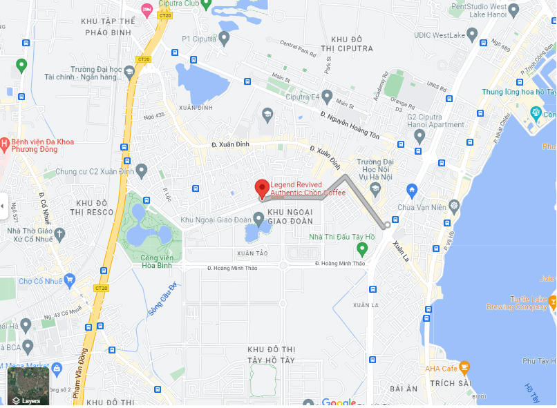

            Cardano Coffee Lounge
==========
🏆🏆 Với kết quả tại Catalyst Fund8, dự án **Cardano Coffee Lounge** đã được giải ngân và đi vào hoạt động. Đây là nơi gặp gỡ, trao đổi dành cho những thành viên yêu thích Blockchain, yêu thích Cardano đến từ Cộng đồng.

{/* Image placeholder: image */}

Khai trương Cardano Coffee Lounge cầu tp. Hồ Chí Minh

{/* Image placeholder: image */}

**Nơi chia sẻ kiến thức về Blockchain, Cardano và Catalyst**

{/* Image placeholder: image */}

## Cardano Coffee Lounge close out report

<iframe width="100%" height="415" src="https://www.youtube.com/embed/TRZOcBDM9Bw" title="Bring smart contract to Vietnam - Func6 - Catalyst" frameborder="0" allow="accelerometer; autoplay; clipboard-write; encrypted-media; gyroscope; picture-in-picture" allowfullscreen></iframe>

## Buổi 1: Lễ ra mắt Cardano Coffee Lounge in Việt Nam
 
{/* Image placeholder: image */}

📣 Và chúng tôi vui mừng thông báo buổi ra mắt tại Hà nội  sẽ được tổ chức vào 14:00 ngày 11/6/2022 tại  [BT2-10 Nguyễn Xuân Khoát, Khu ngoại giao đoàn, Tây Hồ, Hà nội](https://maps.app.goo.gl/6QRmmYxo4XzCQ3aZ7). Đội ngũ thực hiện dự án trân trọng kính mời các Anh Chị Em trong cộng đồng đến tham dự, chia sẻ và kết nối.

👉P/S: Vị trí được chọn được cân nhắc để đảm bảo hoạt động định kỳ 1 buổi/tuần với số người tham dự ít hơn 30 người. Để phục vụ bạn được tốt nhất, vui lòng đăng ký theo [biểu mẫu này](https://forms.gle/ZeNcAHhSKs3CMjLq6)  trước 8:00 ngày 11/6/2022

### Phần 1: Buổi ra mắt Cardano Coffee Lounge

<iframe width="100%" height="415" src="https://www.youtube.com/embed/lL9QcarPOfU" title="Bring smart contract to Vietnam - Func6 - Catalyst" frameborder="0" allow="accelerometer; autoplay; clipboard-write; encrypted-media; gyroscope; picture-in-picture" allowfullscreen></iframe>

### Mr.Đỗ Mạnh Hùng chia sẻ cảm tưởng về dự án Cardano Coffee Lounge

<iframe width="100%" height="415" src="https://www.youtube.com/embed/5CRCgtdBE0c" title="Bring smart contract to Vietnam - Func6 - Catalyst" frameborder="0" allow="accelerometer; autoplay; clipboard-write; encrypted-media; gyroscope; picture-in-picture" allowfullscreen></iframe>

### Mr.Nguyễn Anh Tiến chia sẻ về Cardano, Catalyst tại Cardano Coffee Lounge

<iframe width="100%" height="415" src="https://www.youtube.com/embed/Bji-k726XT0" title="Bring smart contract to Vietnam - Func6 - Catalyst" frameborder="0" allow="accelerometer; autoplay; clipboard-write; encrypted-media; gyroscope; picture-in-picture" allowfullscreen></iframe>

### Một số hình ảnh tại Cardano Coffee Lounge

**Thầy Đỗ Mạnh Hùng và Mr Nguyễn Anh Tiến**

Mr. Đỗ Ngọc Minh khai mạc, tuyên bố lý công bố dự án Cardano Coffee Lounge

TS. Hoàng Văn Thông, Trưởng khoa CNTN, Trường đại học GTVT phát biểu

Mr. Nguyễn Văn Hiệu- Cardano2vn.io chia sẻ về dự án Cardano Coffee Longe

Mr Nguyễn Anh Tiến-Cardano2vn.io chia sẻ về Cardano, Catalyst

Thành viên tham gia đặc các câu hỏi

## Buổi 2: Cardano Coffee Lounge - Làm thế nào để viết được một đề xuất tốt được cấp vốn trên Catalysst

## Buổi 3: Cardano Coffee Lounge - Cách Tiếp cận và phát triển ứng dụng trên nền tảng Blockchain Cardano

<iframe width="100%" height="415" src="https://www.youtube.com/embed/-uvXCxtCU7U" title="Bring smart contract to Vietnam - Func6 - Catalyst" frameborder="0" allow="accelerometer; autoplay; clipboard-write; encrypted-media; gyroscope; picture-in-picture" allowfullscreen></iframe>

## Buổi 4: Cardano Coffee Lounge - Setup node trên nền tảng Blockchain Cardano

{/* Image placeholder: image */}

{/* Image placeholder: image */}

## Buổi 5: Cardano Coffee Lounge - Cách đánh giá đề xuât(PA) và làm thế nào hiệu quả

{/* Image placeholder: image */}

{/* Image placeholder: image */}

{/* Image placeholder: image */}

## Buổi 1-HCM: Khai chương Cardano Coffee Lounge
{/* Image placeholder: image */}

{/* Image placeholder: image */}

{/* Image placeholder: image */}

{/* Image placeholder: image */}

{/* Image placeholder: image */}

{/* Image placeholder: image */}

{/* Image placeholder: image */}

{/* Image placeholder: image */}

<iframe width="100%" height="415" src="https://www.youtube.com/embed/kNkycOsAR2E" title="Bring smart contract to Vietnam - Func6 - Catalyst" frameborder="0" allow="accelerometer; autoplay; clipboard-write; encrypted-media; gyroscope; picture-in-picture" allowfullscreen></iframe>

## Buổi 6-HN: Cardano Coffee Lounge - Native Token

<iframe width="100%" height="415" src="https://www.youtube.com/embed/3VYJA6kpwGk" title="Bring smart contract to Vietnam - Func6 - Catalyst" frameborder="0" allow="accelerometer; autoplay; clipboard-write; encrypted-media; gyroscope; picture-in-picture" allowfullscreen></iframe>

## Buổi 2-HCM: Cardano Coffee Lounge 

{/* Image placeholder: image */}

## Buổi 7-HN: Cardano Coffee Lounge 

{/* Image placeholder: image */}

{/* Image placeholder: image */}

{/* Image placeholder: image */}

## Buổi 3-HCM: Cardano Coffee Lounge “Hướng dẫn chi tiết thực hiện quyền voting của chủ sở hữu ADA cho Catalyst”

{/* Image placeholder: image */}

## Buổi 8-HN: Cardano Coffee Lounge “4 bước Marketing để proposal được nhiều người vote”

{/* Image placeholder: image */}

{/* Image placeholder: image */}

{/* Image placeholder: image */}

{/* Image placeholder: image */}

## Buổi 9-HN: Cardano Coffee Lounge “Cài đặt và vận hành Pool trên Blockchain Cardano”

{/* Image placeholder: image */}

{/* Image placeholder: image */}

{/* Image placeholder: image */}

{/* Image placeholder: image */}

## Buổi 4-HCM: Cardano Coffee Lounge “Kinh nghiệm đánh giá dự án với vai trò PA”

{/* Image placeholder: image */}

## Buổi 10-HN: Cardano Coffee Lounge “Smartcontract Marlowe trên Blockchain Cardano cho người mới”

{/* Image placeholder: image */}

{/* Image placeholder: image */}

{/* Image placeholder: image */}

{/* Image placeholder: image */}

## Buổi 5-HCM: Cardano Coffee Lounge “dApp connnect”

{/* Image placeholder: image */}

{/* Image placeholder: image */}

## Buổi 11-HN: Cardano Coffee Lounge “Mithril: một blockchain mạnh và nhẹ hơn để đạt hiệu quả tốt hơn”

{/* Image placeholder: image */}

{/* Image placeholder: image */}

{/* Image placeholder: image */}

{/* Image placeholder: image */}

## Buổi 6-HCM: Cardano Coffee Lounge “SỰ THẬT VỀ NFT”

{/* Image placeholder: image */}

{/* Image placeholder: image */}

{/* Image placeholder: image */}

## Buổi 7-HCM: Cardano Coffee Lounge “Pháp lý cho các dự án blockchain”

{/* Image placeholder: image */}

{/* Image placeholder: image */}

{/* Image placeholder: image */}

{/* Image placeholder: image */}

## Buổi 12-HN: Cardano Coffee Lounge “Quyền Công dân trên Block Cardano”

{/* Image placeholder: image */}

{/* Image placeholder: image */}

{/* Image placeholder: image */}

{/* Image placeholder: image */}

## Buổi 8-HCM: Cardano Coffee Lounge “Quyền Công dân trên Block Cardano”

{/* Image placeholder: image */}

{/* Image placeholder: image */}

{/* Image placeholder: image */}

## Buổi 13-HN: Cardano Coffee Lounge “dNFT và Ứng dụng trong tương lai!”

{/* Image placeholder: image */}

{/* Image placeholder: image */}

{/* Image placeholder: image */}

## Buổi 9-HCM: Cardano Coffee Lounge “Xây dựng sản phẩm số tinh gọn”

{/* Image placeholder: image */}

{/* Image placeholder: image */}

{/* Image placeholder: image */}

## Buổi 14-HN: Cardano Coffee Lounge “HFC Vasil- Những cập nhật lớn trên Blockchain Carrdano”

{/* Image placeholder: image */}

<iframe width="100%" height="415" src="https://www.youtube.com/embed/DlVMI7w9fTc" title="Bring smart contract to Vietnam - Func6 - Catalyst" frameborder="0" allow="accelerometer; autoplay; clipboard-write; encrypted-media; gyroscope; picture-in-picture" allowfullscreen></iframe>

{/* Image placeholder: image */}

{/* Image placeholder: image */}

{/* Image placeholder: image */}

## Buổi 10-HCM: Cardano Coffee Lounge “Cardano Annual Market Reportn”

{/* Image placeholder: image */}

<iframe width="100%" height="415" src="https://www.youtube.com/embed/6W7fW43DLw8" title="Bring smart contract to Vietnam - Func6 - Catalyst" frameborder="0" allow="accelerometer; autoplay; clipboard-write; encrypted-media; gyroscope; picture-in-picture" allowfullscreen></iframe>

{/* Image placeholder: image */}

{/* Image placeholder: image */}

## Buổi 15-HN: Cardano Coffee Lounge “Layer 1 và 2 trên Blockchain Carrdano”

{/* Image placeholder: image */}

{/* Image placeholder: image */}

{/* Image placeholder: image */}

## Buổi 11-HCM: Cardano Coffee Lounge “Kết quả Catalyst F9 và các thử thách F10”

{/* Image placeholder: image */}

{/* Image placeholder: image */}

{/* Image placeholder: image */}

## Buổi 16-HN: Cardano Coffee Lounge “Các dự án VN chiến thắng Catalyst F9 và nghiên cứu các thử thách F10”

{/* Image placeholder: image */}

{/* Image placeholder: image */}

{/* Image placeholder: image */}

## Buổi 12-HCM: Cardano Coffee Lounge “Layer 1 và 2 trên Blockchain Carrdano”

{/* Image placeholder: image */}

## Buổi 17-HN: Cardano Coffee Lounge “Stablecoin Djed - Cardano và những vị thế cho chúng ta”

{/* Image placeholder: image */}

{/* Image placeholder: image */}

{/* Image placeholder: image */}

## Buổi 13-HCM: Cardano Coffee Lounge “Hiểu về StableCoin Djed-Cardano”

{/* Image placeholder: image */}

{/* Image placeholder: image */}

## Buổi 18-HN: Cardano Coffee Lounge “Mikomeda: Cầu nối đầu tiên của Cardano ra thế giới blockchain”

{/* Image placeholder: image */}

<iframe width="940" height="515" src="https://www.youtube.com/embed/m1Nl5VjobbA" title="Bring smart contract to Vietnam - Func6 - Catalyst" frameborder="0" allow="accelerometer; autoplay; clipboard-write; encrypted-media; gyroscope; picture-in-picture" allowfullscreen></iframe>

{/* Image placeholder: image */}

{/* Image placeholder: image */}

{/* Image placeholder: image */}

## Buổi 14-HCM: Cardano Coffee Lounge “CoTi công ty phát triển Djed”

{/* Image placeholder: image */}

{/* Image placeholder: image */}

## Buổi 19-HN: Cardano Coffee Lounge “Web3 là gì”

{/* Image placeholder: image */}

{/* Image placeholder: image */}

{/* Image placeholder: image */}

## Buổi 15-HCM: Cardano Coffee Lounge “CoTi công ty phát triển Djed (P2)”

{/* Image placeholder: image */}

{/* Image placeholder: image */}

## Buổi 20-HN: Cardano Coffee Lounge “ATALA PRISM Là gì”

{/* Image placeholder: image */}

{/* Image placeholder: image */}

{/* Image placeholder: image */}

{/* Image placeholder: image */}

## Buổi 16-HCM: Cardano Coffee Lounge “Web3 là gì và Ứng dụng”

{/* Image placeholder: image */}

{/* Image placeholder: image */}

{/* Image placeholder: image */}

## Buổi 21-HN: Cardano Coffee Lounge “Cơ Chế đồng thuận Oroboros -Cardano”

{/* Image placeholder: image */}

### Video

<iframe width="940" height="515" src="https://www.youtube.com/embed/xOKdECtQEUg" title="Bring smart contract to Vietnam - Func6 - Catalyst" frameborder="0" allow="accelerometer; autoplay; clipboard-write; encrypted-media; gyroscope; picture-in-picture" allowfullscreen></iframe>

{/* Image placeholder: image */}

{/* Image placeholder: image */}

## Buổi 17-HCM: Cardano Coffee Lounge “Sàn giao dịch tập trung (CEX) kiếm tiền “khủng” như thế nào?"”

{/* Image placeholder: image */}

{/* Image placeholder: image */}

## Buổi 22-HN: Cardano Coffee Lounge “Tìm hiểu về định danh phi tập trung”

{/* Image placeholder: image */}

{/* Image placeholder: image */}

## Buổi 18-HCM: Cardano Coffee Lounge “Tâm an giữa thị trường crypto đầy biến động như thế nào?"”

{/* Image placeholder: image */}

{/* Image placeholder: image */}

{/* Image placeholder: image */}

{/* Image placeholder: image */}

{/* Image placeholder: image */}

## Buổi 23-HN: Cardano Coffee Lounge “Stablecoin Djed mainnet-Cơ hội & rủi ro”

{/* Image placeholder: image */}

{/* Image placeholder: image */}
