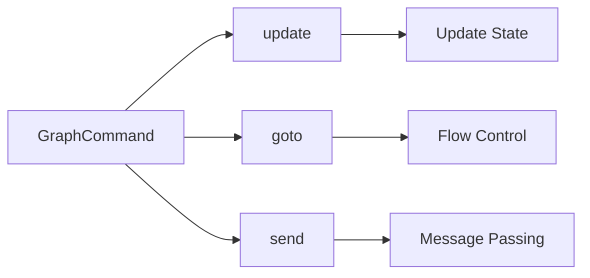
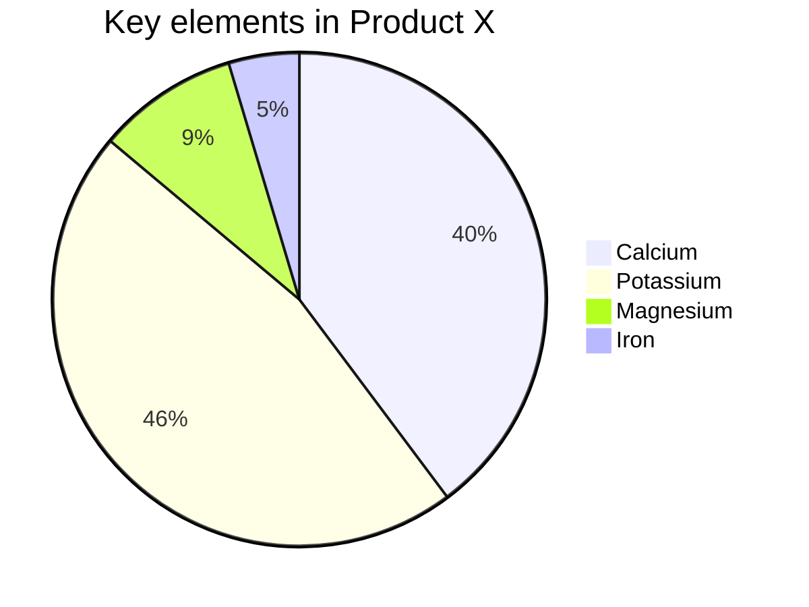
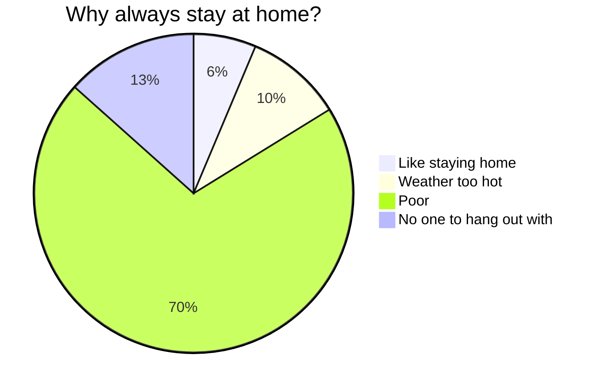

# Exploring the Wonderful World of Markdown - Cardano2vn

## Documentation Navigation

<div className="flex justify-center gap-4 flex-wrap">
  <a href="#overview" className="inline-block">
    
  </a>
  <a href="scripts/WEBSOCKET_README.md" className="inline-block">
    
  </a>
  <a href="tools/MARKDOWN_GUIDE_EN.md" className="inline-block">
    
  </a>
  <a href="BULLY_ALGORITHM_IMPLEMENTATION.md" className="inline-block">
    
  </a>
  <a href="tools/README.md" className="inline-block">
    
  </a>
</div>

---

Welcome to the wonderful world of Markdown! Whether you're a writing enthusiast, developer, blogger, or someone who wants to simply record something, Markdown can become your new best companion. It not only makes writing simple and clear but also easily transforms content into beautiful web formats. Today, we will comprehensively explore the basics and advanced syntax of Markdown, allowing you to fully enjoy the pleasure of writing in this process!

Markdown is a lightweight markup language used to format plain text. It is known for its simple, intuitive syntax and can quickly generate HTML. Markdown is the perfect combination of writing and code - both simple and powerful.

## Basic Markdown Syntax

### 1. Headings: Make Your Content Well-Structured

Use `#` symbols to create headings. Headings start with `#`, and the number of `#` symbols indicates the heading level.

```markdown
# Level 1 Heading

## Level 2 Heading

### Level 3 Heading

#### Level 4 Heading
```

The above code will render a set of well-structured headings, making your content organized and clear.

### 2. Paragraphs and Line Breaks: Natural and Flowing

Paragraphs in Markdown are simply lines of text one after another. To create a new paragraph, just leave a blank line between two lines of text.

### 3. Font Styles: Emphasize Your Text

- **Bold**: Wrap text with two asterisks or underscores, like `**bold**` or `__bold__`.
- *Italic*: Wrap text with one asterisk or underscore, like `*italic*` or `_italic_`.
- ~~Strikethrough~~: Wrap text with two tildes, like `~~strikethrough~~`.

These simple markers can make your content more layered and highlight important points.

### 4. Lists: Neat and Orderly

- **Unordered lists**: Start a line with `-`, `*`, or `+` followed by a space.
- **Ordered lists**: Start a line with numbers followed by a period (`1.`, `2.`).

Want to nest other content in lists? Just indent to achieve nested effects.

- Unordered list item 1
  1. Nested ordered list item 1
  2. Nested ordered list item 2
- Unordered list item 2

1. Ordered list item 1
2. Ordered list item 2

### 5. Links and Images: Rich Content

- **Links**: Create links with square brackets and parentheses `[display text](link address)`.
- **Images**: Similar to links, just add `!` in front, like ``.

[Visit Doocs](https://github.com/doocs)


Easily achieve rich media content display!

> Note: WeChat public platform doesn't support links other than public account content, so links from other platforms will show link styles but cannot be clicked to jump.

> For these links, please write them in plain text, or click "Format -> Convert WeChat External Links to Bottom References" in the top left to enable references, so you can observe the link destinations at the bottom.

Additionally, using the `<,>` syntax can create horizontal sliding slideshows, supporting the WeChat public platform. It's recommended to use images of similar sizes for the best display effect.

### 6. Blockquotes: Quote Famous Sayings or Thought-Provoking Sentences

Use `>` to create blockquotes, just add it in front of the text. Multi-level quotes? Just add another `>` after the previous level.

> This is a blockquote
>
> > This is a nested blockquote

This makes your quotes more layered and meaningful.

### 7. Code Blocks: Showcase Your Code

- **Inline code**: Wrap with backticks, like `code`.
- **Code blocks**: Wrap with three backticks and specify the language, like:

```js
console.log(`Hello, Doocs!`)
```

Syntax highlighting makes your code more readable.

### 8. Horizontal Rules: Separate Content

Use three or more `-`, `*`, or `_` to create horizontal rules.

---

Add visual separation to your content.

### 9. Tables: Clearly Display Data

Markdown supports simple tables, using `|` and `-` to separate cells and headers.

| Project Member                                    | Email                   | WeChat ID   |
| ------------------------------------------------- | ----------------------- | ----------- |
| [yanglbme](https://github.com/yanglbme)           | contact@yanglibin.info  | YLB0109     |
| [YangFong](https://github.com/YangFong)           | yangfong2022@gmail.com  | yq2419731931|
| [thinkasany](https://github.com/thinkasany)       | thinkasany@gmail.com    | thinkasany  |

Such tables make data display much cleaner!

> Manual markup writing too troublesome? We provide a convenient way. Click "Edit -> Insert Table" in the top left to quickly achieve table rendering.

## Advanced Markdown Techniques

### 1. LaTeX Formulas: Perfectly Display Mathematical Expressions

Markdown allows embedding LaTeX syntax to display mathematical formulas:

- **Inline formulas**: Wrap formulas with `$`, like $E = mc^2$.
- **Block formulas**: Wrap formulas with `$$`, like:

$$
\begin{aligned}
d_{i, j} &\leftarrow d_{i, j} + 1 \\
d_{i, y + 1} &\leftarrow d_{i, y + 1} - 1 \\
d_{x + 1, j} &\leftarrow d_{x + 1, j} - 1 \\
d_{x + 1, y + 1} &\leftarrow d_{x + 1, y + 1} + 1
\end{aligned}
$$

1. Block formula in list 1

$$
\chi^2 = \sum \frac{(O - E)^2}{E}
$$

2. Block formula in list 2

$$
\chi^2 = \sum \frac{(|O - E| - 0.5)^2}{E}
$$

This is a powerful tool for displaying complex mathematical expressions!

### 2. Mermaid Flowcharts: Visualize Processes

Mermaid is a powerful visualization tool that can create flowcharts, sequence diagrams, and more in Markdown.








This approach not only intuitively displays processes but also enhances the professionalism of documents.

> For more usage, see: [Mermaid User Guide](https://mermaid.js.org/intro/getting-started.html).

## Conclusion

Markdown is a simple, powerful, and easy-to-master markup language. By learning basic and advanced syntax, you can quickly create content and effectively convey information. Whether it's technical documentation, personal blogs, or project descriptions, Markdown is your reliable assistant. We hope this content can give you a comprehensive understanding of Markdown's potential and make your writing more colorful and diverse!

Now, pick up your Markdown editor and start creating! Explore the world of Markdown, and you'll find it's far more exciting than you imagined!

#### Recommended Reading

- [Alibaba's Another 20k+ Stars Open Source Project Born, Congratulations fastjson!](https://mp.weixin.qq.com/s/RNKDCK2KoyeuMeEs6GUrow)
- [Internet Big Tech Massive Data Interview Questions That Eliminate 90% of Candidates (With Solutions + Method Summary)](https://mp.weixin.qq.com/s/rjGqxUvrEqJNlo09GrT1Dw)
- [Useful! How Does the Long-Awaited Text Block Feature Actually Work in Java 13?](https://mp.weixin.qq.com/s/kalGv5T8AZGxTnLHr2wDsA)
- [2019 GitHub Open Source Contribution Rankings Freshly Released! Microsoft Google Lead, Alibaba Ranks Top 12!](https://mp.weixin.qq.com/s/_q812aGD1b9QvZ2WFI0Qgw)

---

<div className="text-center">
    
</div>
